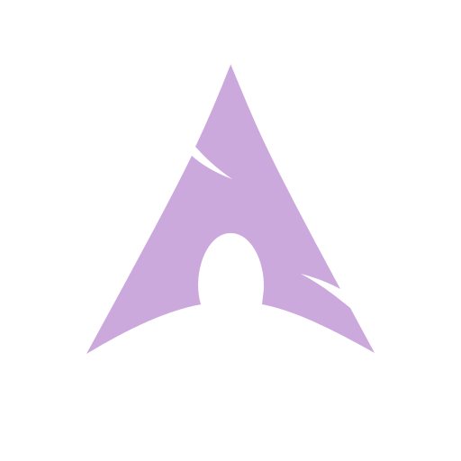
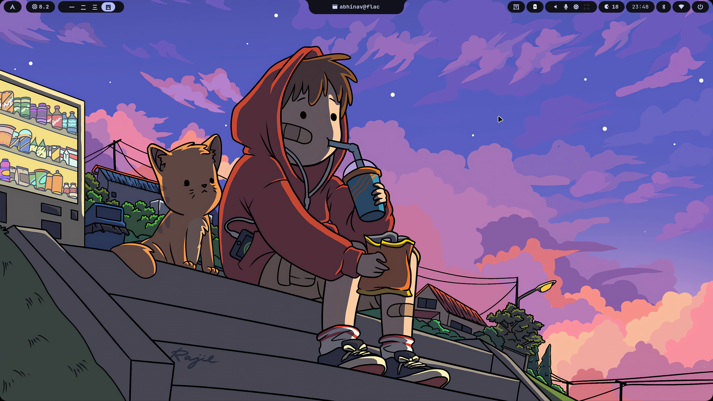
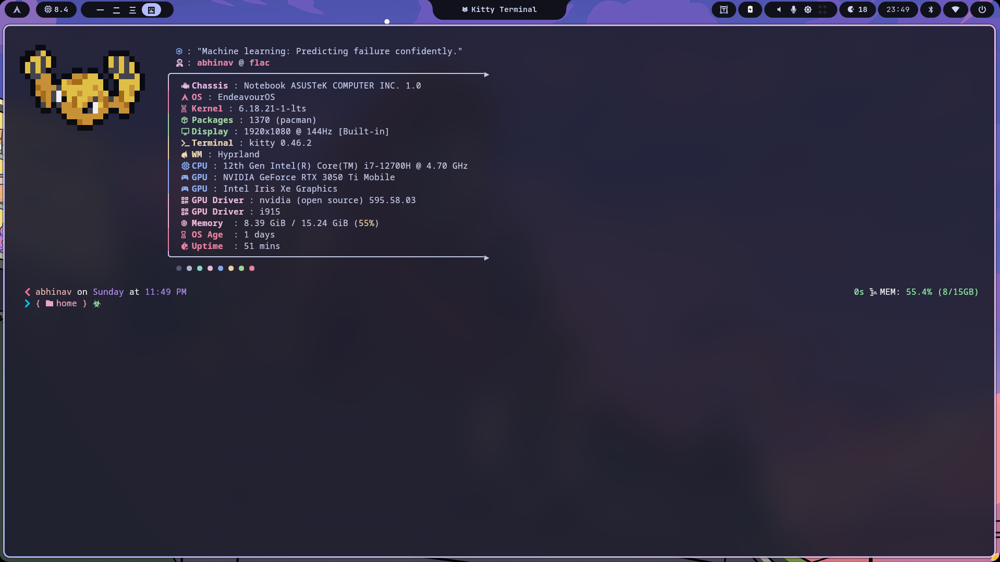
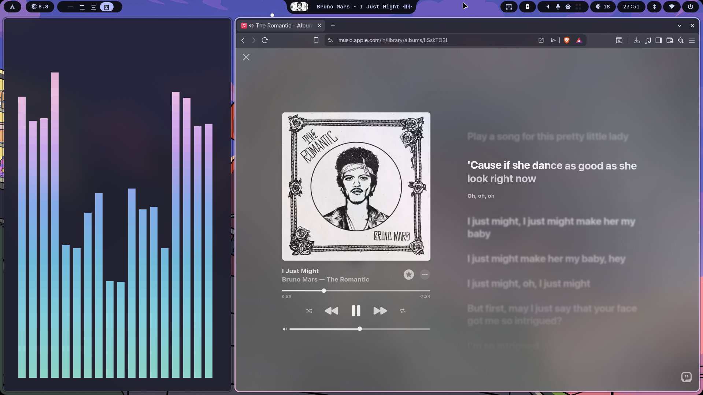
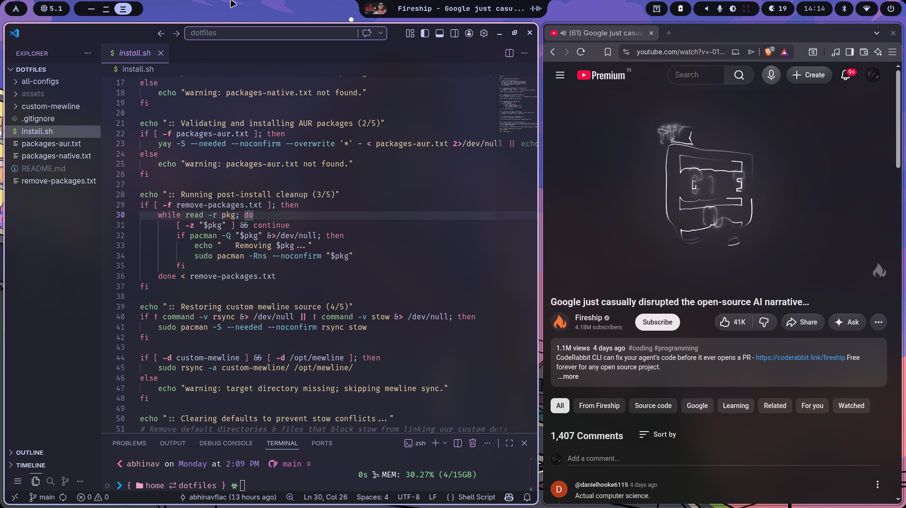
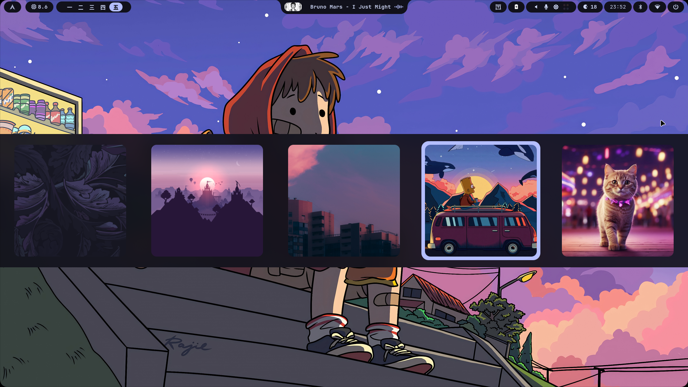
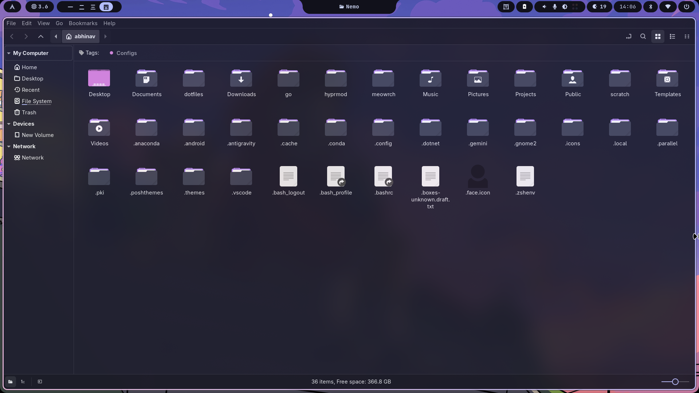
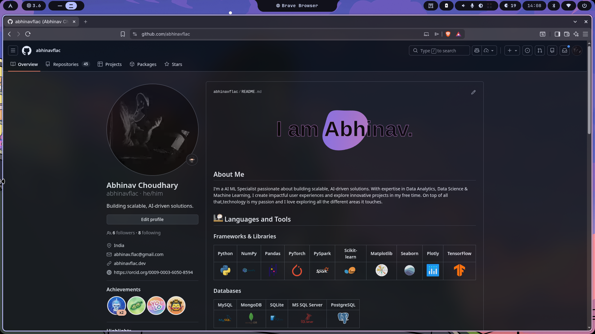
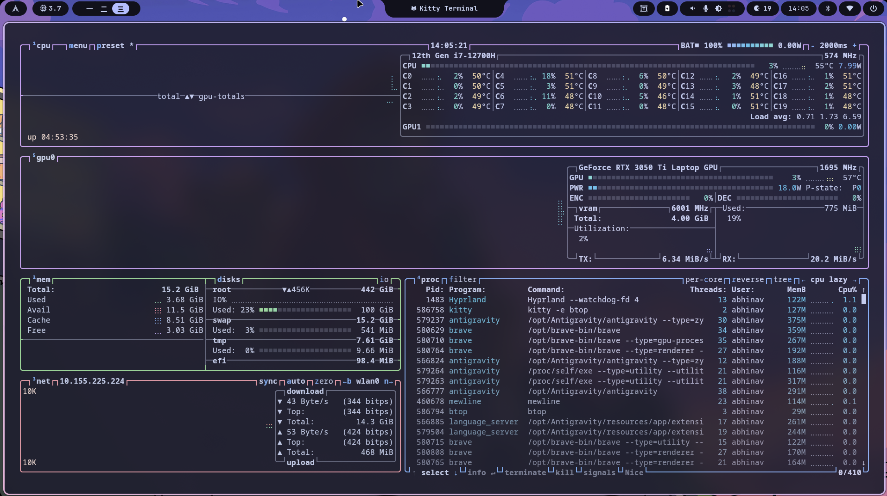

<div align="center">

<table border="0">
  <tr>
      
      
    </td>
  </tr>
</table>
*My personal Arch Linux dotfiles — automated for easy setup.*

> [!TIP]
> **The Audiophile's Soul**: This setup is built with a deep appreciation for high-fidelity music. Unlike generic desktops, every layer of this system—from the TUI clients to the dynamic status island—is tuned to prioritize a premium, distraction-free listening experience.

<br><br/>
<p align="center">
  
  
  
  
  
</p>

</div>

---

<a id="gallery"></a>


<div align="center">
<table><tr><td>

</td><td>

</td></tr><tr><td>

</td><td>

</td></tr><tr><td>

</td><td>

</td></tr><tr><td>

</td><td>

</td></tr></table>
</div>

---

<a id="stack"></a>


| Category | Software |
|---|---|
| **Window Manager** | [Hyprland](https://hyprland.org) |
| **Status Bar** | [Mewline](https://github.com/meowrch/mewline) |
| **Terminal** | [Kitty](https://sw.kovidgoyal.net/kitty/) |
| **Shell** | ZSH + [Oh-My-Posh](https://ohmyposh.dev) |
| **Prompt Extras** | [Starship](https://starship.rs) |
| **Editor** | [Micro](https://micro-editor.github.io) / [Neovim](https://neovim.io) |
| **File Manager** | [Yazi](https://github.com/sxyazi/yazi) / [Nemo](https://github.com/linuxmint/nemo) |
| **App Launcher** | [Rofi](https://github.com/davatorium/rofi) |
| **Notifications** | [Dunst](https://dunst-project.org) / [SwayNC](https://github.com/ErikReider/SwayNotificationCenter) |
| **Multiplexer** | [Tmux](https://github.com/tmux/tmux) |
| **System Monitor** | [Btop](https://github.com/aristocratos/btop) |
| **Music Server** | [MPD](https://www.musicpd.org/) |
| **Music Client** | [RMPC](https://mierak.github.io/rmpc/) / [MPC](https://linux.die.net/man/1/mpc) |
| **Fetch** | [Fastfetch](https://github.com/fastfetch-cli/fastfetch) |
| **Config Manager** | [GNU Stow](https://www.gnu.org/software/stow) |

---

<a id="installation"></a>


Works on any fresh **Arch Linux** or Arch-based installation:

```bash
git clone https://github.com/abhinavflac/dotfiles.git ~/dotfiles
cd ~/dotfiles
sh install.sh
```

> [!NOTE]
> Tested on **EndeavourOS** — should work on other Arch-based distros too.

---

<a id="what-it-does"></a>


The script handles everything in order:

```
Step 1/5 → Validates & installs native packages via pacman
Step 2/5 → Validates & installs AUR packages via yay (auto-bootstrapped if missing)
Step 3/5 → Removes unwanted pre-installed bloatware
Step 4/5 → Syncs custom Mewline source code → /opt/mewline/
Step 5/5 → Clears default config conflicts → links everything via GNU Stow
```
---

<a id="structure"></a>


```
dotfiles/
├── install.sh              # One-click restoration script
├── packages-native.txt     # pacman package list snapshot
├── packages-aur.txt        # AUR package list snapshot
├── remove-packages.txt     # Bloatware to purge on fresh install
├── custom-mewline/         # Full Mewline source (custom fork)
│   └── src/mewline/
│       └── constants.py
└── all-configs/            # GNU Stow root — maps to $HOME
    ├── .zshenv             # Sets ZDOTDIR for ZSH
    ├── .poshthemes/        # Oh-My-Posh shell theme
    └── .config/
        ├── hypr/           # Hyprland + Hyprlock + Hyprpaper
        ├── kitty/          # Terminal config
        ├── zsh/            # ZSH config + prompt + plugins
        ├── tmux/           # Tmux config
        ├── yazi/           # File manager config
        ├── rofi/           # App launcher theme
        ├── btop/           # System monitor config
        ├── fastfetch/      # Fetch config
        ├── dunst/          # Notification daemon
        ├── swaync/         # Notification center
        ├── mpd/            # Music Player Daemon config
        └── rmpc/           # Beautiful TUI music client config
```

---

<a id="workflow"></a>


Since configs are symlinked via GNU Stow, edits inside `~/.config` automatically reflect in the repo.

To push your latest changes:

```bash
cd ~/dotfiles
git add .
git commit -m "update: description"
git push
```

Mewline changes require a manual sync since it lives in `/opt/`:

```bash
sudo rsync -a ~/dotfiles/custom-mewline/ /opt/mewline/
```

---

<a id="music-flow"></a>


The music system is built on a four-layer architecture for maximum control and aesthetic integration:

- **Layer 1: The Core (MPD)** → A high-performance daemon running in the background, serving high-fedelity audio via PipeWire.
- **Layer 2: The Command (MPC)** → A lightweight CLI used for global hotkeys (Play/Next/Prev) managed by Hyprland.
- **Layer 3: The Interaction (RMPC)** → A beautiful, rust-powered TUI client for managing playlists and browsing your library.
- **Layer 4: The Visual (Mewline)** → Dynamic Island integration via `mpd-mpris`, showing live track details and visualizers.

### 🎧 Navidrome & Google Drive Server
My dotfiles automatically provision a high-fidelity FLAC streaming server using Navidrome backed by a Google Drive rclone mount.

**Post-Installation Steps (One-Time Only):**
Because Google Drive credentials cannot be stored in GitHub, you must link your account once after a fresh install:
1. Run `rclone config` in your terminal.
2. Create a new remote and name it **exactly** `gdrive` (Select Google Drive, follow the browser prompts).
3. The background service (`rclone.service`) will now automatically mount your music to `~/gdrive`.
4. Run `cd ~/.config/navidrome && docker-compose up -d` to spin up your Navidrome server!

---

<div align="center">
  <p>🎨 Made with passion for the perfect rice  Arch btw</p>
</div>
